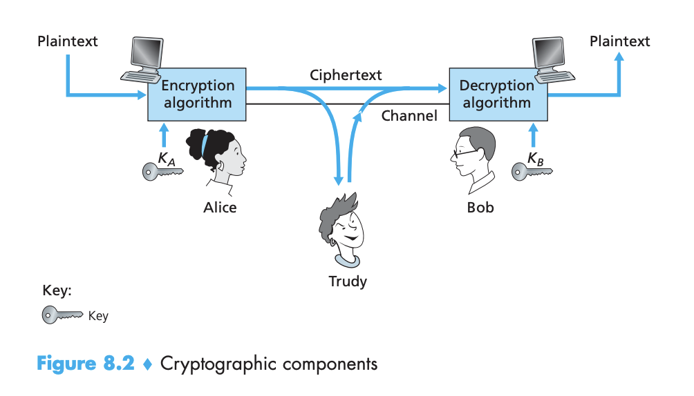

## 8.1 Network Security

### Properties of secure communication:

- Confidentiality
- Message integrity: content is not altered in transit
- End-point authentication: both sender and receiver should be able to confirm the identity of the other party involved in the communication
- Operational security: make sure that organizational networks are not compromised (firewalls, intrusion detection systems)

#### An intruder can potentially perform:

- Eavesdropping - sniffing and recording messages on the channel
- Modification, insertion, deletion of messages/content of the messages

### 8.2 Principles of Cryptography 

Modern cryptographic techniques, including many of those used in the Internet, are based on advances made in the past 30 years.
[Codebreakers, Kahn](https://www.amazon.com/Codebreakers-Comprehensive-History-Communication-Internet/dp/0684831309)

Key systems:
- Symmetric: Alice's and Bob's keys are identical and are secret.
- Public: A pair of keys is used, one of them is known to the whole world and the other one is only known to Bob or Alice (not to both)

### Symmetric key systems:

- Caesar cipher - shifting by k letters - easy to break, there are only 25 possible key values
- Monoalphabetic cipher - substitute one letter with another letter of the alphabet - there are 26! possible pairings. Brute force approach would require too much time, however, by statistical analysis of the plaintext language, it is relatively easy to break the code.
- Polyalphabetic - use multiple monoalphabetic ciphers so that the same letter appearing in different positions in text might be encoded differently\
  \
    Three different scenarios of attacks:
    - Ciphertext-only attack - statistical analysis of the intercepted cipher-text
    - Known-plaintext attack - when an intruder knows some of the (plaintext, ciphertext) pairings
    - Chosen-plaintext attack - the intruder is able to choose the plaintext message and obtain its corresponding ciphertext form.
    
#### Block ciphers 

There are two broad classes:
- Stream ciphers
- Block ciphers: used in PGP(for secure e-mail), SSL, and IPsec

In a block cipher, the message to be encrypted is processed in blocks of k bits. To encode a block, the cipher uses a one-to-one mapping to map the k-bit block of cleartext to a k-bit block of ciphertext. To thwart brute-force attacks, block ciphers typically use much larger blocks, consisting of k=64 bits or even larger. Maintaining a translation table with $2^k$ isn't feasible. Instead, block ciphers typically use functions that simulate randomly permuted tables. Popular block ciphers include DES (64bit blocks with a 56-bit key), 3DES, AES (128-bit blocks). 

###### Cipher-block chaining 
When using block ciphers, it's possible to have a number of identical cleartext blocks that produce identical ciphertexts. An attacker could potentially guess the cleartext in this scenario using knowledge about the underlying protocol structure. To address this problem. we can mix some randomness so that identical plaintext blocks produce different ciphertext.\
Block ciphers typically use **Cipher Block Chaining** 
- Before encrypting the message, the sender generates a random k-bit string, called the **Initialization Vector** *c(0)*. The sender sends the IV to the receiver in cleartext.
- For the first block, the sender calculates the exclusive-or of the first block of cleartext with the IV. It then runs the results through the block-cipher algorithm to get the ciphertext block. *c(1)=Ks(m(1) XOR c(0))* where Ks is the block-cipher algo function
- For the ith block, the sender calculates the encrypted block as follows: *c(i) = Ks(m(i) XOR c(i-1))*

The question is how to distribute the IV from sender to receiver safely?

### Public key encryption

In public key encryption both parties have 2 keys: a public one, available to everyone, and a private one. A known encryption algorithm is used. Let's assume that Kbpr is Bob's private key, and Kbpu - public. There are encryption/decryption techniques such that *Kbpr(Kbpu(m)) = m* 

#### RSA
RSA makes extensive use of arithmetic operations using modulo-n-arithmetic.

The security of RSA relies on the fact that there are no known algorithms for quickly factoring a number into primes p and q. 

